This notebook walks through Activity 5 in small runnable chunks. The goal is to
compare controlled improvements to the Activity 3 ARIMA forecasts while keeping
the same test period, forecast horizons, FluSight quantile format, and
evaluation metrics used in Activity 4.

The variants compared here are:

- Original Activity 3 ARIMA forecasts.
- Rolling interval-calibration variants that widen uncertainty using only prior
  realized forecast errors.
- ARIMA-persistence ensemble variants that move the ARIMA forecast center
  toward the latest observed admission count available at the reference date.
- A final selected ensemble that writes Activity 5 outputs.


``` r
# Show warnings in the notebook output, but keep package startup messages quiet.
knitr::opts_chunk$set(message = FALSE, warning = TRUE)

# Make paths work whether this notebook is rendered from the repo root, from
# USE-ME/carolmoreira, from output/scripts, or chunk-by-chunk in VS Code.
find_project_dir <- function(start_dir = getwd()) {
  start_dir <- normalizePath(start_dir, mustWork = TRUE)
  candidates <- unique(c(
    start_dir,
    file.path(start_dir, "USE-ME", "carolmoreira"),
    file.path(start_dir, ".."),
    file.path(start_dir, "..", ".."),
    file.path(start_dir, "..", "..", ".."),
    file.path(start_dir, "..", "..", "USE-ME", "carolmoreira")
  ))
  candidates <- normalizePath(candidates, mustWork = FALSE)
  candidates <- candidates[file.exists(file.path(
    candidates,
    "output/data/01_cleaning/cleaned_flu_admissions.csv"
  ))]
  if (!length(candidates)) {
    stop("Could not find USE-ME/carolmoreira. Open this Rmd from the course repo or set the working directory to USE-ME/carolmoreira.")
  }
  candidates[1]
}

project_dir <- find_project_dir()

# During knitting, this makes every later chunk evaluate from USE-ME/carolmoreira.
knitr::opts_knit$set(root.dir = project_dir)

# During interactive chunk execution, setting the working directory makes the
# same relative paths work immediately in the console. During knitting, root.dir
# already handles this and avoids a working-directory warning.
if (!isTRUE(getOption("knitr.in.progress"))) {
  setwd(project_dir)
}
cat("Working directory:", project_dir, "\n")
```

```
## Working directory: /Users/carolmoreira/sismid/SISMID-2026-HumanAI/USE-ME/carolmoreira
```

## Load Packages


``` r
# The same core packages from Activities 3 and 4 are used here.
# scoringutils provides WIS, median absolute error, and interval coverage.
required <- c("readr", "dplyr", "tidyr", "ggplot2", "scoringutils")
missing <- required[!vapply(required, requireNamespace, logical(1), quietly = TRUE)]
if (length(missing)) {
  stop("Required R package(s) not installed: ", paste(missing, collapse = ", "))
}

library(readr)
library(dplyr)
```

```
## Warning: package 'dplyr' was built under R version 4.4.3
```

``` r
library(tidyr)
library(ggplot2)
library(scoringutils)

# Print metric tables with consistent rounding. This keeps notebook tables easy
# to scan while preserving full-precision CSV outputs later.
format_metric_table <- function(x) {
  x %>%
    mutate(
      across(any_of(c("mae", "rmse", "mean_wis", "mean_width_95")), ~round(.x, 1)),
      coverage_95 = if ("coverage_95" %in% names(.)) paste0(round(100 * coverage_95, 1), "%") else coverage_95
    )
}
```

## Define Inputs, Outputs, and Quantiles


``` r
# Upstream inputs produced by earlier activities.
truth_csv <- "output/data/01_cleaning/cleaned_flu_admissions.csv"
baseline_forecast_csv <- "output/data/03_forecast/flusight_forecasts.csv"
baseline_scores_csv <- "output/data/04_evaluation/forecast_scores.csv"

# Activity 5 output files. These do not overwrite Activity 3 or Activity 4.
improved_forecast_csv <- "output/data/05_improvements/ensemble_flusight_forecasts.csv"
improved_scores_csv <- "output/data/05_improvements/ensemble_forecast_scores.csv"
improved_summary_csv <- "output/data/05_improvements/ensemble_summary_by_horizon.csv"
comparison_csv <- "output/data/05_improvements/activity5_model_comparison_by_horizon.csv"
spec_csv <- "output/data/05_improvements/ensemble_specification.csv"
forecast_png <- "output/figures/05_improvements/ensemble_forecast_vs_observed.png"
comparison_png <- "output/figures/05_improvements/activity5_metric_comparison.png"
baseline_error_png <- "output/figures/05_improvements/baseline_absolute_error_over_time.png"
interval_wis_png <- "output/figures/05_improvements/interval_calibration_wis_progression.png"
interval_metrics_png <- "output/figures/05_improvements/interval_calibration_metrics_progression.png"
ensemble_wis_png <- "output/figures/05_improvements/ensemble_wis_progression.png"
ensemble_metrics_png <- "output/figures/05_improvements/ensemble_metrics_progression.png"
all_variants_wis_png <- "output/figures/05_improvements/all_variants_wis_progression.png"
final_change_png <- "output/figures/05_improvements/final_model_metric_changes.png"
observed_trend_png <- "output/figures/05_improvements/observed_admissions_overview.png"
observed_distribution_png <- "output/figures/05_improvements/observed_admissions_distribution.png"
baseline_distribution_png <- "output/figures/05_improvements/baseline_forecast_distribution_overview.png"

dir.create(dirname(improved_forecast_csv), recursive = TRUE, showWarnings = FALSE)
dir.create(dirname(forecast_png), recursive = TRUE, showWarnings = FALSE)

# FluSight quantile ladder used in Activity 3.
quantiles <- c(.01, .025, .05, .10, .15, .20, .25, .30, .35, .40, .45, .50,
               .55, .60, .65, .70, .75, .80, .85, .90, .95, .975, .99)
required_quantiles <- paste0("q", quantiles)

stopifnot(file.exists(truth_csv))
stopifnot(file.exists(baseline_forecast_csv))
stopifnot(file.exists(baseline_scores_csv))
```

## Load and Validate Observed Data


``` r
# Read the cleaned national influenza admissions series.
truth <- read_csv(truth_csv, show_col_types = FALSE) %>%
  mutate(
    week = as.Date(week),
    value = as.numeric(value),
    location = as.character(location)
  ) %>%
  select(week, location, observed = value) %>%
  arrange(week)

# These checks protect every downstream comparison.
if (!identical(names(truth), c("week", "location", "observed"))) {
  stop("Observed data columns are invalid.")
}
if (anyNA(truth$week) || anyNA(truth$observed)) {
  stop("Observed data could not be parsed.")
}
if (any(truth$location != "US")) {
  stop("Observed data must contain only location == 'US'.")
}
if (anyDuplicated(truth$week)) {
  stop("Observed data contains duplicate weeks.")
}
if (any(diff(truth$week) != 7)) {
  stop("Observed weeks are not evenly spaced.")
}
if (any(truth$observed < 0)) {
  stop("Observed admissions cannot be negative.")
}

summary(truth$observed)
```

```
##    Min. 1st Qu.  Median    Mean 3rd Qu.    Max. 
##     0.0   508.5  1087.0  4790.0  3300.5 55739.0
```


``` r
# Plot the full observed time series so the later forecast errors can be read
# against the epidemic trajectory.
observed_trend_plot <- ggplot(truth, aes(x = week, y = observed)) +
  geom_line(color = "#0072B2", linewidth = .8) +
  geom_point(color = "#0072B2", size = 1.1, alpha = .8) +
  scale_y_continuous(limits = c(0, max(truth$observed, na.rm = TRUE) + 10000)) +
  labs(
    x = "Week",
    y = "Weekly influenza hospitalizations",
    title = "Observed National Influenza Hospitalizations",
    subtitle = "Cleaned weekly US admissions used as truth for Activities 3-5."
  ) +
  theme_minimal()

observed_distribution_plot <- ggplot(truth, aes(x = observed)) +
  geom_histogram(bins = 35, fill = "#56B4E9", color = "white") +
  geom_vline(aes(xintercept = median(observed)), color = "#D55E00", linewidth = 1) +
  labs(
    x = "Weekly influenza hospitalizations",
    y = "Number of weeks",
    title = "Distribution of Observed Weekly Admissions",
    subtitle = "Orange line marks the median; the long right tail reflects winter surges."
  ) +
  theme_minimal()

ggsave(observed_trend_png, observed_trend_plot, width = 10, height = 5.5, dpi = 300)
ggsave(observed_distribution_png, observed_distribution_plot, width = 10, height = 5.5, dpi = 300)

observed_trend_plot
```

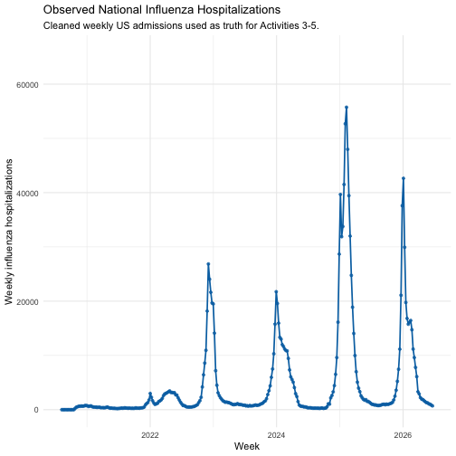

``` r
observed_distribution_plot
```

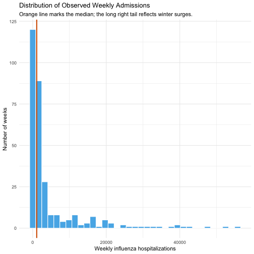

## Load and Validate Activity 3 Forecasts


``` r
# Read the Activity 3 ARIMA forecasts in long FluSight format.
baseline_fc <- read_csv(baseline_forecast_csv, show_col_types = FALSE) %>%
  mutate(
    reference_date = as.Date(reference_date),
    target_end_date = as.Date(target_end_date),
    horizon = as.integer(horizon),
    location = as.character(location),
    output_type = as.character(output_type),
    output_type_id = as.numeric(output_type_id),
    value = as.numeric(value)
  )

expected_fc_cols <- c(
  "reference_date", "target", "horizon", "target_end_date",
  "location", "output_type", "output_type_id", "value"
)

if (!identical(names(baseline_fc), expected_fc_cols)) {
  stop("Forecast columns do not match the expected schema.")
}
if (anyNA(baseline_fc$reference_date) ||
    anyNA(baseline_fc$target_end_date) ||
    anyNA(baseline_fc$value)) {
  stop("Forecast dates or values could not be parsed.")
}
if (any(baseline_fc$location != "US")) {
  stop("Forecast data must contain only location == 'US'.")
}
if (any(baseline_fc$output_type != "quantile")) {
  stop("Forecast output_type must be 'quantile'.")
}
if (!all(baseline_fc$horizon %in% 1:3)) {
  stop("Forecast horizons must be 1, 2, and 3.")
}
if (any(baseline_fc$target_end_date != baseline_fc$reference_date + 7 * baseline_fc$horizon)) {
  stop("Forecast target_end_date is inconsistent with reference_date and horizon.")
}

# Check the full quantile ladder for every forecast instance.
ladder_check <- baseline_fc %>%
  group_by(reference_date, horizon) %>%
  summarise(
    n_rows = n(),
    ladder_ok = setequal(output_type_id, quantiles),
    .groups = "drop"
  )

if (any(ladder_check$n_rows != length(quantiles)) || !all(ladder_check$ladder_ok)) {
  stop("Every forecast must contain the full 23-level FluSight quantile ladder.")
}

# Convert to wide format: one row per reference date and horizon.
baseline_wide <- baseline_fc %>%
  arrange(reference_date, horizon, output_type_id) %>%
  pivot_wider(names_from = output_type_id, values_from = value, names_prefix = "q") %>%
  arrange(reference_date, horizon)

if (!all(required_quantiles %in% names(baseline_wide))) {
  stop("Wide forecasts are missing required quantile columns.")
}

baseline_wide %>%
  select(reference_date, horizon, target_end_date, q0.025, q0.5, q0.975) %>%
  head(9)
```

```
## # A tibble: 9 x 6
##   reference_date horizon target_end_date q0.025  q0.5 q0.975
##   <date>           <int> <date>           <dbl> <dbl>  <dbl>
## 1 2025-09-27           1 2025-10-04           0  1150   4464
## 2 2025-09-27           2 2025-10-11           0  1218   8001
## 3 2025-09-27           3 2025-10-18           0  1218  10985
## 4 2025-10-04           1 2025-10-11           0   908   4216
## 5 2025-10-04           2 2025-10-18           0   850   7621
## 6 2025-10-04           3 2025-10-25           0   850  10598
## 7 2025-10-11           1 2025-10-18           0  1043   4345
## 8 2025-10-11           2 2025-10-25           0  1079   7837
## 9 2025-10-11           3 2025-11-01           0  1079  10809
```


``` r
# Visualize the Activity 3 forecast distribution before making Activity 5
# changes. The ribbons show how interval width grows with forecast horizon.
baseline_plot_q <- baseline_wide %>%
  select(horizon, target_end_date, q0.025, q0.5, q0.975) %>%
  mutate(horizon_label = factor(paste0(horizon, " wk"),
                                levels = c("1 wk", "2 wk", "3 wk")))

baseline_observed_plot <- truth %>%
  filter(week >= min(baseline_plot_q$target_end_date),
         week <= max(baseline_plot_q$target_end_date))

baseline_distribution_plot <- ggplot() +
  geom_ribbon(data = baseline_plot_q,
              aes(x = target_end_date, ymin = q0.025, ymax = q0.975,
                  fill = horizon_label),
              alpha = .18, show.legend = FALSE) +
  geom_line(data = baseline_observed_plot,
            aes(x = week, y = observed),
            color = "black", linewidth = .8) +
  geom_line(data = baseline_plot_q,
            aes(x = target_end_date, y = q0.5, color = horizon_label),
            linewidth = .8) +
  facet_wrap(~horizon_label, ncol = 1) +
  scale_color_manual(values = c("1 wk" = "#0072B2", "2 wk" = "#E69F00", "3 wk" = "#009E73"),
                     name = "Horizon") +
  scale_fill_manual(values = c("1 wk" = "#0072B2", "2 wk" = "#E69F00", "3 wk" = "#009E73")) +
  labs(
    x = "Target week",
    y = "Weekly influenza hospitalizations",
    title = "Original Activity 3 Forecast Distributions",
    subtitle = "Black line is observed admissions; colored lines and ribbons are ARIMA medians and 95% intervals."
  ) +
  theme_minimal()

ggsave(baseline_distribution_png, baseline_distribution_plot, width = 10, height = 8, dpi = 300)
baseline_distribution_plot
```

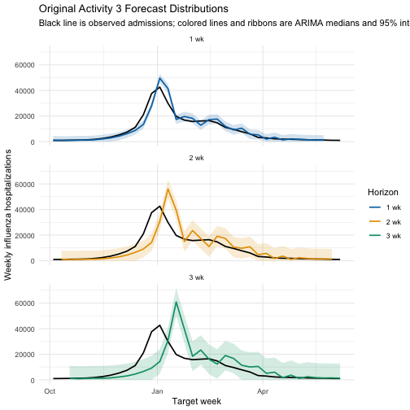

## Scoring Helper

This helper scores any wide quantile forecast table with the same metrics used
in Activity 4.


``` r
score_forecasts <- function(wide_forecasts, model_name) {
  # Join truth by target_end_date. Future targets without observations are not
  # scored because the outcome is not yet known.
  scorable <- wide_forecasts %>%
    inner_join(truth, by = c("target_end_date" = "week", "location")) %>%
    arrange(reference_date, horizon)

  if (!nrow(scorable)) {
    stop("No forecast target dates have observed outcomes.")
  }
  if (!all(required_quantiles %in% names(scorable))) {
    stop("Scorable forecasts are missing required quantile columns.")
  }

  quantile_levels <- as.numeric(sub("^q", "", required_quantiles))
  quantile_predictions <- as.matrix(scorable[, required_quantiles])

  scores <- scorable %>%
    transmute(
      model = model_name,
      reference_date,
      horizon,
      target_end_date,
      location,
      observed,
      median = q0.5,
      absolute_error = scoringutils::ae_median_quantile(
        observed, quantile_predictions, quantile_levels
      ),
      squared_error = (median - observed)^2,
      wis = scoringutils::wis(
        observed, quantile_predictions, quantile_levels,
        count_median_twice = TRUE
      ),
      lower_95 = q0.025,
      upper_95 = q0.975,
      coverage_95 = scoringutils::interval_coverage(
        observed, quantile_predictions, quantile_levels,
        interval_range = 95
      ),
      width_95 = upper_95 - lower_95
    )

  summary <- scores %>%
    group_by(model, horizon) %>%
    summarise(
      n_forecasts = n(),
      mae = mean(absolute_error),
      rmse = sqrt(mean(squared_error)),
      mean_wis = mean(wis),
      coverage_95 = mean(coverage_95),
      mean_width_95 = mean(width_95),
      .groups = "drop"
    )

  list(scores = scores, summary = summary)
}
```

## Baseline: Original Activity 3 ARIMA


``` r
baseline_scored <- score_forecasts(baseline_wide, "Original ARIMA")

baseline_scored$summary %>%
  format_metric_table() %>%
  knitr::kable(caption = "Original Activity 3 ARIMA evaluation by forecast horizon.")
```


Table: Original Activity 3 ARIMA evaluation by forecast horizon.

|model          | horizon| n_forecasts|    mae|    rmse| mean_wis|coverage_95 | mean_width_95|
|:--------------|-------:|-----------:|------:|-------:|--------:|:-----------|-------------:|
|Original ARIMA |       1|          34| 1954.2|  3404.7|   1547.4|88.2%       |        6257.3|
|Original ARIMA |       2|          34| 4407.7|  7925.6|   3532.0|85.3%       |       12096.6|
|Original ARIMA |       3|          34| 6102.2| 11355.9|   4914.4|85.3%       |       16682.6|


``` r
# The detailed score table shows one row per reference date and horizon.
# This is useful for spotting when the model missed badly.
baseline_scored$scores %>%
  arrange(desc(absolute_error)) %>%
  select(reference_date, horizon, target_end_date, observed, median,
         absolute_error, wis, coverage_95, width_95) %>%
  head(12) %>%
  format_metric_table() %>%
  knitr::kable(caption = "Largest original ARIMA misses across all scored forecasts.")
```


Table: Largest original ARIMA misses across all scored forecasts.

|reference_date | horizon|target_end_date | observed| median| absolute_error|       wis|coverage_95 | width_95|
|:--------------|-------:|:---------------|--------:|------:|--------------:|---------:|:-----------|--------:|
|2025-12-27     |       3|2026-01-17      |    19754|  60812|          41058| 37090.220|0%          |    21694|
|2025-12-06     |       3|2025-12-27      |    37602|   9168|          28434| 24911.015|0%          |    18791|
|2025-12-13     |       3|2026-01-03      |    42634|  14291|          28343| 24808.958|0%          |    19322|
|2025-12-27     |       2|2026-01-10      |    29933|  56081|          26148| 23480.197|0%          |    14586|
|2025-12-13     |       2|2025-12-27      |    37602|  14291|          23311| 20860.137|0%          |    13400|
|2026-01-03     |       3|2026-01-24      |    16819|  39537|          22718| 18743.300|0%          |    21732|
|2026-01-03     |       2|2026-01-17      |    19754|  39537|          19783| 17035.603|0%          |    15023|
|2025-11-29     |       3|2025-12-20      |    21083|   6536|          14547| 11009.917|0%          |    16159|
|2025-12-06     |       2|2025-12-20      |    21083|   9168|          11915|  9471.950|0%          |    13359|
|2025-12-20     |       2|2026-01-03      |    42634|  30729|          11905|  9352.077|0%          |    13958|
|2026-01-03     |       1|2026-01-10      |    29933|  41438|          11505| 10186.447|0%          |     7208|
|2025-12-20     |       1|2025-12-27      |    37602|  28033|           9569|  8331.872|0%          |     6762|


``` r
# Plot error over time by horizon. Large spikes identify weeks where Activity 5
# improvements have the most room to help.
baseline_error_plot <- ggplot(baseline_scored$scores,
                              aes(x = target_end_date, y = absolute_error, color = factor(horizon))) +
  geom_line(linewidth = .75) +
  geom_point(size = 1.7) +
  scale_color_manual(values = c("1" = "#0072B2", "2" = "#E69F00", "3" = "#009E73"),
                     name = "Horizon") +
  labs(
    x = "Target week",
    y = "Absolute error",
    title = "Original ARIMA Absolute Error Over Time",
    subtitle = "Higher values indicate target weeks where the baseline model missed more."
  ) +
  theme_minimal()

ggsave(baseline_error_png, baseline_error_plot, width = 10, height = 6, dpi = 300)
baseline_error_plot
```

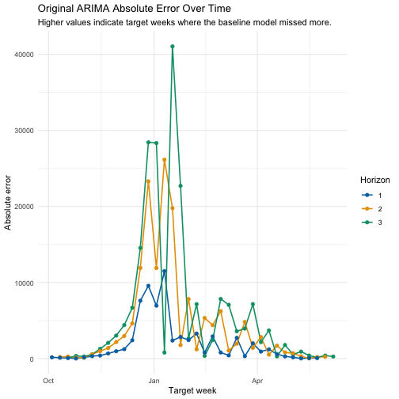

## Variant 1: Rolling Interval Calibration

This variant keeps the ARIMA median fixed and widens intervals when earlier
forecast errors suggest the original intervals were too narrow.

For a forecast issued at reference date `r`, the multiplier is estimated from
the same horizon's previous errors with `target_end_date <= r`. That means only
outcomes already observed at the reference date are used.


``` r
build_interval_calibrated_forecast <- function(calibration_probability = 0.95,
                                               minimum_prior_errors = 6) {
  baseline_scorable <- baseline_wide %>%
    inner_join(truth, by = c("target_end_date" = "week", "location")) %>%
    mutate(
      half_width_95 = (q0.975 - q0.025) / 2,
      standardized_error_95 = abs(observed - q0.5) / half_width_95
    )

  if (any(!is.finite(baseline_scorable$standardized_error_95))) {
    stop("Cannot calibrate because at least one 95% half-width is invalid.")
  }

  calibrated_rows <- vector("list", nrow(baseline_wide))
  audit_rows <- vector("list", nrow(baseline_wide))

  for (i in seq_len(nrow(baseline_wide))) {
    current <- baseline_wide[i, ]

    prior_errors <- baseline_scorable %>%
      filter(
        horizon == current$horizon,
        target_end_date <= current$reference_date
      )

    if (nrow(prior_errors) >= minimum_prior_errors) {
      multiplier <- as.numeric(quantile(
        prior_errors$standardized_error_95,
        probs = calibration_probability,
        na.rm = TRUE,
        names = FALSE,
        type = 8
      ))
      multiplier <- max(1, multiplier)
      source <- "prior horizon-specific errors"
    } else {
      multiplier <- 1
      source <- "insufficient prior errors"
    }

    median_value <- current$q0.5
    adjusted <- current
    for (q_name in required_quantiles) {
      if (q_name == "q0.5") {
        adjusted[[q_name]] <- median_value
      } else {
        adjusted[[q_name]] <- round(pmax(median_value + multiplier * (current[[q_name]] - median_value), 0))
      }
    }

    # Enforce monotone quantiles after rounding and zero-clamping.
    adjusted[required_quantiles] <- as.list(cummax(as.numeric(adjusted[required_quantiles])))
    calibrated_rows[[i]] <- adjusted

    audit_rows[[i]] <- tibble(
      reference_date = current$reference_date,
      horizon = current$horizon,
      calibration_probability = calibration_probability,
      n_prior_errors = nrow(prior_errors),
      interval_multiplier = multiplier,
      calibration_source = source
    )
  }

  list(
    wide = bind_rows(calibrated_rows),
    audit = bind_rows(audit_rows)
  )
}
```


``` r
# Compare several calibration strengths. Larger probabilities usually widen
# intervals more aggressively, which may improve coverage but can worsen WIS.
calibration_grid <- c(.50, .60, .70, .75, .80, .85, .90, .95)

calibration_results <- lapply(calibration_grid, function(probability) {
  variant <- build_interval_calibrated_forecast(calibration_probability = probability)
  scored <- score_forecasts(
    variant$wide,
    paste0("Interval calibration p=", probability)
  )
  scored$summary %>%
    mutate(variant_type = "Interval calibration",
           variant_value = probability)
}) %>%
  bind_rows()

calibration_results %>%
  arrange(horizon, variant_value) %>%
  format_metric_table() %>%
  knitr::kable(caption = "Rolling interval-calibration variants by horizon.")
```


Table: Rolling interval-calibration variants by horizon.

|model                       | horizon| n_forecasts|    mae|    rmse| mean_wis|coverage_95 | mean_width_95|variant_type         | variant_value|
|:---------------------------|-------:|-----------:|------:|-------:|--------:|:-----------|-------------:|:--------------------|-------------:|
|Interval calibration p=0.5  |       1|          34| 1954.2|  3404.7|   1547.4|88.2%       |        6257.3|Interval calibration |          0.50|
|Interval calibration p=0.6  |       1|          34| 1954.2|  3404.7|   1547.4|88.2%       |        6257.3|Interval calibration |          0.60|
|Interval calibration p=0.7  |       1|          34| 1954.2|  3404.7|   1547.4|88.2%       |        6257.3|Interval calibration |          0.70|
|Interval calibration p=0.75 |       1|          34| 1954.2|  3404.7|   1541.4|88.2%       |        6583.7|Interval calibration |          0.75|
|Interval calibration p=0.8  |       1|          34| 1954.2|  3404.7|   1515.7|88.2%       |        7804.8|Interval calibration |          0.80|
|Interval calibration p=0.85 |       1|          34| 1954.2|  3404.7|   1524.4|88.2%       |        9711.1|Interval calibration |          0.85|
|Interval calibration p=0.9  |       1|          34| 1954.2|  3404.7|   1579.9|91.2%       |       11811.8|Interval calibration |          0.90|
|Interval calibration p=0.95 |       1|          34| 1954.2|  3404.7|   1604.6|91.2%       |       13538.0|Interval calibration |          0.95|
|Interval calibration p=0.5  |       2|          34| 4407.7|  7925.6|   3532.0|85.3%       |       12096.6|Interval calibration |          0.50|
|Interval calibration p=0.6  |       2|          34| 4407.7|  7925.6|   3532.0|85.3%       |       12096.6|Interval calibration |          0.60|
|Interval calibration p=0.7  |       2|          34| 4407.7|  7925.6|   3520.2|85.3%       |       12882.7|Interval calibration |          0.70|
|Interval calibration p=0.75 |       2|          34| 4407.7|  7925.6|   3541.9|85.3%       |       14337.6|Interval calibration |          0.75|
|Interval calibration p=0.8  |       2|          34| 4407.7|  7925.6|   3542.3|85.3%       |       16193.1|Interval calibration |          0.80|
|Interval calibration p=0.85 |       2|          34| 4407.7|  7925.6|   3652.1|85.3%       |       19504.9|Interval calibration |          0.85|
|Interval calibration p=0.9  |       2|          34| 4407.7|  7925.6|   3736.7|85.3%       |       23826.4|Interval calibration |          0.90|
|Interval calibration p=0.95 |       2|          34| 4407.7|  7925.6|   3757.9|91.2%       |       27777.0|Interval calibration |          0.95|
|Interval calibration p=0.5  |       3|          34| 6102.2| 11355.9|   4914.4|85.3%       |       16682.6|Interval calibration |          0.50|
|Interval calibration p=0.6  |       3|          34| 6102.2| 11355.9|   4914.4|85.3%       |       16682.6|Interval calibration |          0.60|
|Interval calibration p=0.7  |       3|          34| 6102.2| 11355.9|   4946.8|85.3%       |       17791.9|Interval calibration |          0.70|
|Interval calibration p=0.75 |       3|          34| 6102.2| 11355.9|   4939.8|85.3%       |       19985.5|Interval calibration |          0.75|
|Interval calibration p=0.8  |       3|          34| 6102.2| 11355.9|   4995.3|85.3%       |       23326.5|Interval calibration |          0.80|
|Interval calibration p=0.85 |       3|          34| 6102.2| 11355.9|   5147.1|88.2%       |       28248.3|Interval calibration |          0.85|
|Interval calibration p=0.9  |       3|          34| 6102.2| 11355.9|   5268.0|88.2%       |       32629.1|Interval calibration |          0.90|
|Interval calibration p=0.95 |       3|          34| 6102.2| 11355.9|   5390.7|88.2%       |       36250.8|Interval calibration |          0.95|


``` r
interval_wis_plot <- ggplot(calibration_results,
                            aes(x = variant_value, y = mean_wis, color = factor(horizon))) +
  geom_line(linewidth = .8) +
  geom_point(size = 2) +
  scale_color_manual(values = c("1" = "#0072B2", "2" = "#E69F00", "3" = "#009E73"),
                     name = "Horizon") +
  labs(
    x = "Calibration quantile used for prior standardized errors",
    y = "Mean WIS",
    title = "Interval Calibration Progression",
    subtitle = "Lower WIS is better; aggressive widening can improve coverage but penalize sharpness."
  ) +
  theme_minimal()

ggsave(interval_wis_png, interval_wis_plot, width = 10, height = 6, dpi = 300)
interval_wis_plot
```

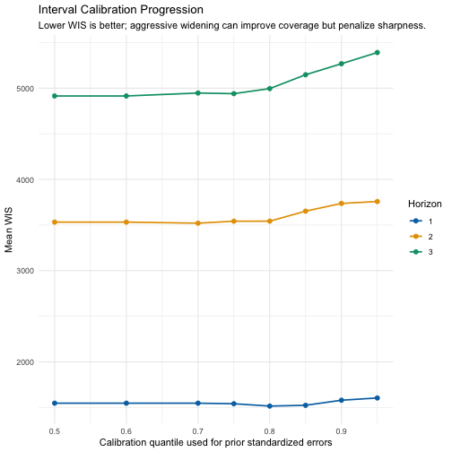


``` r
# This companion plot shows the calibration tradeoff directly:
# stronger calibration usually increases interval width, sometimes improving
# coverage but often worsening WIS because sharpness is penalized.
calibration_plot_data <- calibration_results %>%
  select(horizon, variant_value, mean_wis, coverage_95, mean_width_95) %>%
  pivot_longer(c(mean_wis, coverage_95, mean_width_95),
               names_to = "metric", values_to = "value") %>%
  mutate(metric = recode(metric,
                         mean_wis = "Mean WIS",
                         coverage_95 = "95% coverage",
                         mean_width_95 = "Mean 95% interval width"))

interval_metrics_plot <- ggplot(calibration_plot_data,
                                aes(x = variant_value, y = value, color = factor(horizon))) +
  geom_line(linewidth = .75) +
  geom_point(size = 1.8) +
  facet_wrap(~metric, scales = "free_y", ncol = 1) +
  scale_color_manual(values = c("1" = "#0072B2", "2" = "#E69F00", "3" = "#009E73"),
                     name = "Horizon") +
  labs(
    x = "Calibration quantile",
    y = NULL,
    title = "Interval Calibration: WIS, Coverage, and Width",
    subtitle = "This variant mostly trades sharper intervals for wider intervals."
  ) +
  theme_minimal()

ggsave(interval_metrics_png, interval_metrics_plot, width = 10, height = 9, dpi = 300)
interval_metrics_plot
```

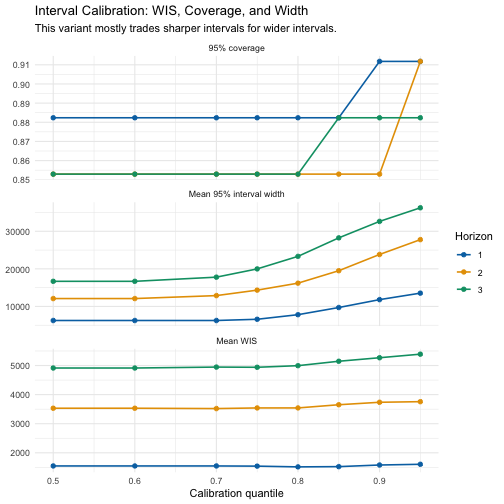

## Variant 2: ARIMA-Persistence Ensemble

This variant blends the ARIMA median with the latest observed value at the
reference date. The same shift is applied to the full ARIMA quantile
distribution, preserving most of the original interval shape.


``` r
build_ensemble_forecast <- function(persistence_weight = 0.25) {
  if (!is.numeric(persistence_weight) ||
      length(persistence_weight) != 1 ||
      persistence_weight < 0 ||
      persistence_weight > 1) {
    stop("persistence_weight must be a single number between 0 and 1.")
  }

  arima_weight <- 1 - persistence_weight
  truth_lookup <- setNames(truth$observed, as.character(truth$week))

  with_persistence <- baseline_wide %>%
    mutate(persistence = as.numeric(truth_lookup[as.character(reference_date)]))

  if (anyNA(with_persistence$persistence)) {
    stop("A reference-date persistence value is missing.")
  }

  ensemble_rows <- vector("list", nrow(with_persistence))

  for (i in seq_len(nrow(with_persistence))) {
    current <- with_persistence[i, ]
    arima_median <- current$q0.5
    ensemble_median <- round(arima_weight * arima_median +
                               persistence_weight * current$persistence)

    adjusted <- current
    for (q_name in required_quantiles) {
      if (q_name == "q0.5") {
        adjusted[[q_name]] <- ensemble_median
      } else {
        adjusted[[q_name]] <- round(pmax(ensemble_median + (current[[q_name]] - arima_median), 0))
      }
    }

    # Enforce monotone quantiles after rounding and zero-clamping.
    adjusted[required_quantiles] <- as.list(cummax(as.numeric(adjusted[required_quantiles])))
    adjusted$persistence <- NULL
    ensemble_rows[[i]] <- adjusted
  }

  bind_rows(ensemble_rows)
}
```


``` r
# Try a progression of persistence weights. Weight 0 reproduces the original
# ARIMA distribution; larger weights move the center closer to persistence.
ensemble_grid <- c(0, .05, .10, .15, .20, .25, .30, .40, .50)

ensemble_results <- lapply(ensemble_grid, function(weight) {
  variant <- build_ensemble_forecast(persistence_weight = weight)
  scored <- score_forecasts(
    variant,
    paste0("Ensemble weight=", weight)
  )
  scored$summary %>%
    mutate(variant_type = "ARIMA-persistence ensemble",
           variant_value = weight)
}) %>%
  bind_rows()

ensemble_results %>%
  arrange(horizon, variant_value) %>%
  format_metric_table() %>%
  knitr::kable(caption = "ARIMA-persistence ensemble variants by horizon.")
```


Table: ARIMA-persistence ensemble variants by horizon.

|model                | horizon| n_forecasts|    mae|    rmse| mean_wis|coverage_95 | mean_width_95|variant_type               | variant_value|
|:--------------------|-------:|-----------:|------:|-------:|--------:|:-----------|-------------:|:--------------------------|-------------:|
|Ensemble weight=0    |       1|          34| 1954.2|  3404.7|   1547.4|88.2%       |        6257.3|ARIMA-persistence ensemble |          0.00|
|Ensemble weight=0.05 |       1|          34| 1922.6|  3396.1|   1528.4|88.2%       |        6254.6|ARIMA-persistence ensemble |          0.05|
|Ensemble weight=0.1  |       1|          34| 1891.1|  3396.1|   1512.9|88.2%       |        6251.8|ARIMA-persistence ensemble |          0.10|
|Ensemble weight=0.15 |       1|          34| 1859.9|  3404.4|   1501.1|88.2%       |        6249.0|ARIMA-persistence ensemble |          0.15|
|Ensemble weight=0.2  |       1|          34| 1842.5|  3421.2|   1494.6|88.2%       |        6246.2|ARIMA-persistence ensemble |          0.20|
|Ensemble weight=0.25 |       1|          34| 1859.2|  3446.4|   1494.2|88.2%       |        6243.5|ARIMA-persistence ensemble |          0.25|
|Ensemble weight=0.3  |       1|          34| 1877.1|  3479.7|   1499.5|91.2%       |        6240.7|ARIMA-persistence ensemble |          0.30|
|Ensemble weight=0.4  |       1|          34| 1913.0|  3569.7|   1525.8|91.2%       |        6235.2|ARIMA-persistence ensemble |          0.40|
|Ensemble weight=0.5  |       1|          34| 1948.9|  3689.0|   1569.2|88.2%       |        6229.7|ARIMA-persistence ensemble |          0.50|
|Ensemble weight=0    |       2|          34| 4407.7|  7925.6|   3532.0|85.3%       |       12096.6|ARIMA-persistence ensemble |          0.00|
|Ensemble weight=0.05 |       2|          34| 4376.2|  7873.1|   3515.2|85.3%       |       12089.4|ARIMA-persistence ensemble |          0.05|
|Ensemble weight=0.1  |       2|          34| 4344.8|  7827.4|   3502.1|85.3%       |       12082.2|ARIMA-persistence ensemble |          0.10|
|Ensemble weight=0.15 |       2|          34| 4339.9|  7788.6|   3492.6|85.3%       |       12075.1|ARIMA-persistence ensemble |          0.15|
|Ensemble weight=0.2  |       2|          34| 4352.2|  7756.8|   3487.2|85.3%       |       12067.9|ARIMA-persistence ensemble |          0.20|
|Ensemble weight=0.25 |       2|          34| 4364.7|  7732.3|   3484.6|85.3%       |       12060.8|ARIMA-persistence ensemble |          0.25|
|Ensemble weight=0.3  |       2|          34| 4376.9|  7714.9|   3485.5|85.3%       |       12053.7|ARIMA-persistence ensemble |          0.30|
|Ensemble weight=0.4  |       2|          34| 4408.6|  7701.9|   3495.8|85.3%       |       12039.4|ARIMA-persistence ensemble |          0.40|
|Ensemble weight=0.5  |       2|          34| 4442.6|  7718.0|   3515.5|85.3%       |       12025.1|ARIMA-persistence ensemble |          0.50|
|Ensemble weight=0    |       3|          34| 6102.2| 11355.9|   4914.4|85.3%       |       16682.6|ARIMA-persistence ensemble |          0.00|
|Ensemble weight=0.05 |       3|          34| 6075.6| 11262.8|   4893.5|85.3%       |       16671.5|ARIMA-persistence ensemble |          0.05|
|Ensemble weight=0.1  |       3|          34| 6059.1| 11174.5|   4875.6|85.3%       |       16660.5|ARIMA-persistence ensemble |          0.10|
|Ensemble weight=0.15 |       3|          34| 6060.8| 11091.1|   4860.6|85.3%       |       16649.4|ARIMA-persistence ensemble |          0.15|
|Ensemble weight=0.2  |       3|          34| 6065.1| 11012.8|   4847.8|85.3%       |       16638.3|ARIMA-persistence ensemble |          0.20|
|Ensemble weight=0.25 |       3|          34| 6071.8| 10939.7|   4837.3|85.3%       |       16627.3|ARIMA-persistence ensemble |          0.25|
|Ensemble weight=0.3  |       3|          34| 6078.5| 10871.8|   4827.7|85.3%       |       16616.3|ARIMA-persistence ensemble |          0.30|
|Ensemble weight=0.4  |       3|          34| 6091.8| 10752.1|   4815.6|85.3%       |       16594.1|ARIMA-persistence ensemble |          0.40|
|Ensemble weight=0.5  |       3|          34| 6107.1| 10654.5|   4810.0|85.3%       |       16572.0|ARIMA-persistence ensemble |          0.50|


``` r
ensemble_wis_plot <- ggplot(ensemble_results,
                            aes(x = variant_value, y = mean_wis, color = factor(horizon))) +
  geom_line(linewidth = .8) +
  geom_point(size = 2) +
  scale_color_manual(values = c("1" = "#0072B2", "2" = "#E69F00", "3" = "#009E73"),
                     name = "Horizon") +
  labs(
    x = "Persistence weight",
    y = "Mean WIS",
    title = "ARIMA-Persistence Ensemble Progression",
    subtitle = "The selected 0.25 weight improves WIS at all horizons in this held-out period."
  ) +
  theme_minimal()

ggsave(ensemble_wis_png, ensemble_wis_plot, width = 10, height = 6, dpi = 300)
ensemble_wis_plot
```

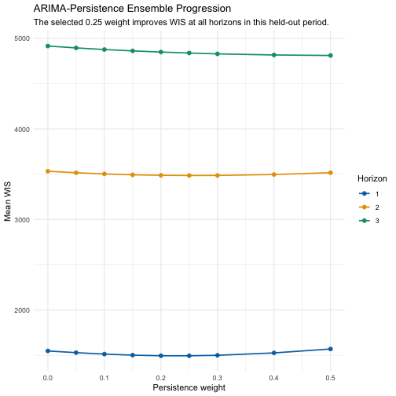


``` r
# Evaluate the ensemble progression across all required Activity 5 metrics.
# This shows why the 0.25 persistence weight is a reasonable final choice:
# it improves WIS at all horizons and improves longer-horizon RMSE while keeping
# coverage similar to the original model.
ensemble_plot_data <- ensemble_results %>%
  select(horizon, variant_value, mae, rmse, mean_wis, coverage_95, mean_width_95) %>%
  pivot_longer(c(mae, rmse, mean_wis, coverage_95, mean_width_95),
               names_to = "metric", values_to = "value") %>%
  mutate(metric = recode(metric,
                         mae = "MAE",
                         rmse = "RMSE",
                         mean_wis = "Mean WIS",
                         coverage_95 = "95% coverage",
                         mean_width_95 = "Mean 95% interval width"))

ensemble_metrics_plot <- ggplot(ensemble_plot_data,
                                aes(x = variant_value, y = value, color = factor(horizon))) +
  geom_line(linewidth = .75) +
  geom_point(size = 1.8) +
  facet_wrap(~metric, scales = "free_y", ncol = 2) +
  scale_color_manual(values = c("1" = "#0072B2", "2" = "#E69F00", "3" = "#009E73"),
                     name = "Horizon") +
  labs(
    x = "Persistence weight",
    y = NULL,
    title = "Ensemble Progression Across Evaluation Metrics",
    subtitle = "Each point is a complete held-out evaluation of one ensemble weight."
  ) +
  theme_minimal()

ggsave(ensemble_metrics_png, ensemble_metrics_plot, width = 11, height = 8, dpi = 300)
ensemble_metrics_plot
```

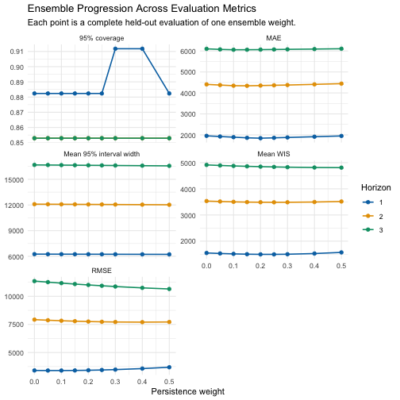

## Compare Variant Families


``` r
all_variant_results <- bind_rows(
  baseline_scored$summary %>%
    mutate(variant_type = "Baseline",
           variant_value = 0),
  calibration_results,
  ensemble_results
)

best_by_horizon <- all_variant_results %>%
  group_by(horizon) %>%
  slice_min(mean_wis, n = 5, with_ties = FALSE) %>%
  arrange(horizon, mean_wis) %>%
  ungroup()

best_by_horizon %>%
  format_metric_table() %>%
  knitr::kable(caption = "Top five variants by mean WIS within each horizon.")
```


Table: Top five variants by mean WIS within each horizon.

|model                | horizon| n_forecasts|    mae|    rmse| mean_wis|coverage_95 | mean_width_95|variant_type               | variant_value|
|:--------------------|-------:|-----------:|------:|-------:|--------:|:-----------|-------------:|:--------------------------|-------------:|
|Ensemble weight=0.25 |       1|          34| 1859.2|  3446.4|   1494.2|88.2%       |        6243.5|ARIMA-persistence ensemble |          0.25|
|Ensemble weight=0.2  |       1|          34| 1842.5|  3421.2|   1494.6|88.2%       |        6246.2|ARIMA-persistence ensemble |          0.20|
|Ensemble weight=0.3  |       1|          34| 1877.1|  3479.7|   1499.5|91.2%       |        6240.7|ARIMA-persistence ensemble |          0.30|
|Ensemble weight=0.15 |       1|          34| 1859.9|  3404.4|   1501.1|88.2%       |        6249.0|ARIMA-persistence ensemble |          0.15|
|Ensemble weight=0.1  |       1|          34| 1891.1|  3396.1|   1512.9|88.2%       |        6251.8|ARIMA-persistence ensemble |          0.10|
|Ensemble weight=0.25 |       2|          34| 4364.7|  7732.3|   3484.6|85.3%       |       12060.8|ARIMA-persistence ensemble |          0.25|
|Ensemble weight=0.3  |       2|          34| 4376.9|  7714.9|   3485.5|85.3%       |       12053.7|ARIMA-persistence ensemble |          0.30|
|Ensemble weight=0.2  |       2|          34| 4352.2|  7756.8|   3487.2|85.3%       |       12067.9|ARIMA-persistence ensemble |          0.20|
|Ensemble weight=0.15 |       2|          34| 4339.9|  7788.6|   3492.6|85.3%       |       12075.1|ARIMA-persistence ensemble |          0.15|
|Ensemble weight=0.4  |       2|          34| 4408.6|  7701.9|   3495.8|85.3%       |       12039.4|ARIMA-persistence ensemble |          0.40|
|Ensemble weight=0.5  |       3|          34| 6107.1| 10654.5|   4810.0|85.3%       |       16572.0|ARIMA-persistence ensemble |          0.50|
|Ensemble weight=0.4  |       3|          34| 6091.8| 10752.1|   4815.6|85.3%       |       16594.1|ARIMA-persistence ensemble |          0.40|
|Ensemble weight=0.3  |       3|          34| 6078.5| 10871.8|   4827.7|85.3%       |       16616.3|ARIMA-persistence ensemble |          0.30|
|Ensemble weight=0.25 |       3|          34| 6071.8| 10939.7|   4837.3|85.3%       |       16627.3|ARIMA-persistence ensemble |          0.25|
|Ensemble weight=0.2  |       3|          34| 6065.1| 11012.8|   4847.8|85.3%       |       16638.3|ARIMA-persistence ensemble |          0.20|


``` r
# Put both variant families on one WIS plot. The baseline is shown as the
# ensemble weight 0 and calibration probability 0 marker in the table above;
# the plot below separates the two progression paths for readability.
all_variant_plot <- bind_rows(
  calibration_results %>%
    mutate(variant_label = "Interval calibration",
           x_value = variant_value),
  ensemble_results %>%
    mutate(variant_label = "ARIMA-persistence ensemble",
           x_value = variant_value)
)

all_variants_wis_plot <- ggplot(all_variant_plot,
                                aes(x = x_value, y = mean_wis, color = factor(horizon))) +
  geom_line(linewidth = .75) +
  geom_point(size = 1.8) +
  facet_wrap(~variant_label, scales = "free_x", ncol = 1) +
  scale_color_manual(values = c("1" = "#0072B2", "2" = "#E69F00", "3" = "#009E73"),
                     name = "Horizon") +
  labs(
    x = "Variant setting",
    y = "Mean WIS",
    title = "All Activity 5 Variant Progressions",
    subtitle = "Lower WIS is better. The ensemble path improves more consistently than interval-only calibration."
  ) +
  theme_minimal()

ggsave(all_variants_wis_png, all_variants_wis_plot, width = 10, height = 8, dpi = 300)
all_variants_wis_plot
```

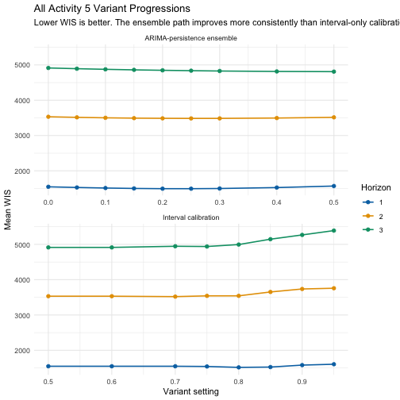


``` r
# Select a simple, explainable ensemble weight that improves WIS at all three
# horizons while using only information available at the forecast reference date.
selected_persistence_weight <- 0.25
final_wide <- build_ensemble_forecast(persistence_weight = selected_persistence_weight)
final_scored <- score_forecasts(final_wide, "ARIMA-persistence ensemble")

final_comparison <- bind_rows(
  baseline_scored$summary,
  final_scored$summary
) %>%
  arrange(horizon, model)

final_comparison %>%
  format_metric_table() %>%
  knitr::kable(caption = "Final selected model compared with the original ARIMA baseline.")
```


Table: Final selected model compared with the original ARIMA baseline.

|model                      | horizon| n_forecasts|    mae|    rmse| mean_wis|coverage_95 | mean_width_95|
|:--------------------------|-------:|-----------:|------:|-------:|--------:|:-----------|-------------:|
|ARIMA-persistence ensemble |       1|          34| 1859.2|  3446.4|   1494.2|88.2%       |        6243.5|
|Original ARIMA             |       1|          34| 1954.2|  3404.7|   1547.4|88.2%       |        6257.3|
|ARIMA-persistence ensemble |       2|          34| 4364.7|  7732.3|   3484.6|85.3%       |       12060.8|
|Original ARIMA             |       2|          34| 4407.7|  7925.6|   3532.0|85.3%       |       12096.6|
|ARIMA-persistence ensemble |       3|          34| 6071.8| 10939.7|   4837.3|85.3%       |       16627.3|
|Original ARIMA             |       3|          34| 6102.2| 11355.9|   4914.4|85.3%       |       16682.6|


``` r
# Compute signed changes so the direction of improvement is explicit.
# Negative values are improvements for MAE, RMSE, WIS, and interval width.
# Positive values are improvements for coverage only when coverage was below 95%.
final_changes <- final_comparison %>%
  select(model, horizon, mae, rmse, mean_wis, coverage_95, mean_width_95) %>%
  pivot_longer(c(mae, rmse, mean_wis, coverage_95, mean_width_95),
               names_to = "metric", values_to = "value") %>%
  pivot_wider(names_from = model, values_from = value) %>%
  mutate(change = `ARIMA-persistence ensemble` - `Original ARIMA`,
         percent_change = 100 * change / `Original ARIMA`)

final_changes %>%
  mutate(
    `Original ARIMA` = round(`Original ARIMA`, 2),
    `ARIMA-persistence ensemble` = round(`ARIMA-persistence ensemble`, 2),
    change = round(change, 2),
    percent_change = paste0(round(percent_change, 2), "%")
  ) %>%
  knitr::kable(caption = "Final model changes relative to original ARIMA.")
```


Table: Final model changes relative to original ARIMA.

| horizon|metric        | ARIMA-persistence ensemble| Original ARIMA|  change|percent_change |
|-------:|:-------------|--------------------------:|--------------:|-------:|:--------------|
|       1|mae           |                    1859.18|        1954.18|  -95.00|-4.86%         |
|       1|rmse          |                    3446.43|        3404.72|   41.70|1.22%          |
|       1|mean_wis      |                    1494.18|        1547.45|  -53.27|-3.44%         |
|       1|coverage_95   |                       0.88|           0.88|    0.00|0%             |
|       1|mean_width_95 |                    6243.50|        6257.29|  -13.79|-0.22%         |
|       2|mae           |                    4364.68|        4407.71|  -43.03|-0.98%         |
|       2|rmse          |                    7732.30|        7925.58| -193.28|-2.44%         |
|       2|mean_wis      |                    3484.61|        3531.95|  -47.34|-1.34%         |
|       2|coverage_95   |                       0.85|           0.85|    0.00|0%             |
|       2|mean_width_95 |                   12060.76|       12096.56|  -35.79|-0.3%          |
|       3|mae           |                    6071.82|        6102.24|  -30.41|-0.5%          |
|       3|rmse          |                   10939.74|       11355.90| -416.16|-3.66%         |
|       3|mean_wis      |                    4837.26|        4914.41|  -77.15|-1.57%         |
|       3|coverage_95   |                       0.85|           0.85|    0.00|0%             |
|       3|mean_width_95 |                   16627.26|       16682.62|  -55.35|-0.33%         |


``` r
# Plot the signed final changes by metric. Bars below zero are improvements for
# MAE, RMSE, WIS, and interval width. Coverage is shown as a direct percentage-
# point change, so zero means the ensemble preserved the original coverage.
final_change_plot_data <- final_changes %>%
  mutate(
    horizon_label = factor(paste0(horizon, " week"), levels = c("1 week", "2 week", "3 week")),
    metric = recode(metric,
                    mae = "MAE",
                    rmse = "RMSE",
                    mean_wis = "Mean WIS",
                    coverage_95 = "95% coverage",
                    mean_width_95 = "Mean 95% interval width"),
    display_change = ifelse(metric == "95% coverage", 100 * change, change)
  )

final_change_plot <- ggplot(final_change_plot_data,
                            aes(x = horizon_label, y = display_change, fill = metric)) +
  geom_hline(yintercept = 0, color = "grey35", linewidth = .4) +
  geom_col(width = .62, show.legend = FALSE) +
  facet_wrap(~metric, scales = "free_y", ncol = 2) +
  labs(
    x = "Forecast horizon",
    y = "Ensemble minus original ARIMA",
    title = "Final Ensemble Changes Relative to Original ARIMA",
    subtitle = "Below zero is better for MAE, RMSE, WIS, and interval width; coverage is shown in percentage points."
  ) +
  theme_minimal()

ggsave(final_change_png, final_change_plot, width = 11, height = 8, dpi = 300)
final_change_plot
```

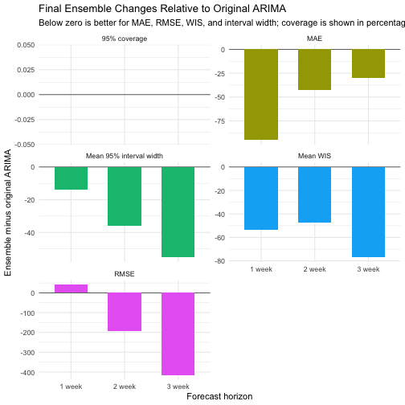

## Final Comparison Plot


``` r
comparison_plot_data <- final_comparison %>%
  mutate(horizon_label = factor(paste0(horizon, " week"),
                                levels = c("1 week", "2 week", "3 week"))) %>%
  select(model, horizon_label, mae, rmse, mean_wis, coverage_95, mean_width_95) %>%
  pivot_longer(
    c(mae, rmse, mean_wis, coverage_95, mean_width_95),
    names_to = "metric",
    values_to = "value"
  ) %>%
  mutate(metric = recode(
    metric,
    mae = "MAE",
    rmse = "RMSE",
    mean_wis = "Mean WIS",
    coverage_95 = "95% coverage",
    mean_width_95 = "Mean 95% interval width"
  ))

comparison_plot <- ggplot(comparison_plot_data,
                          aes(x = horizon_label, y = value, fill = model)) +
  geom_col(position = position_dodge(width = .75), width = .62) +
  facet_wrap(~metric, scales = "free_y", ncol = 2) +
  scale_fill_manual(values = c("Original ARIMA" = "#0072B2",
                               "ARIMA-persistence ensemble" = "#D55E00")) +
  labs(
    x = "Forecast horizon",
    y = NULL,
    fill = "Model",
    title = "Activity 5 Evaluation: Original vs Ensemble",
    subtitle = "Lower is better for MAE, RMSE, and WIS; 95% coverage should be close to 95%."
  ) +
  theme_minimal()

comparison_plot
```

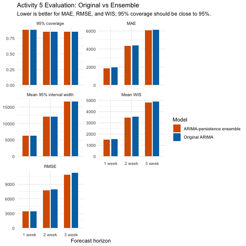

## Forecast Plot for the Selected Ensemble


``` r
final_long <- final_wide %>%
  select(reference_date, target, horizon, target_end_date, location,
         output_type, all_of(required_quantiles)) %>%
  pivot_longer(
    all_of(required_quantiles),
    names_to = "quantile_name",
    values_to = "value"
  ) %>%
  mutate(output_type_id = as.numeric(sub("^q", "", quantile_name))) %>%
  select(reference_date, target, horizon, target_end_date, location,
         output_type, output_type_id, value) %>%
  arrange(reference_date, horizon, output_type_id)

observed_plot <- truth %>%
  filter(week >= min(final_long$reference_date),
         week <= max(final_long$target_end_date)) %>%
  select(week, observed)

plot_q <- final_long %>%
  filter(output_type_id %in% c(.025, .5, .975)) %>%
  select(horizon, target_end_date, output_type_id, value) %>%
  pivot_wider(names_from = output_type_id, values_from = value) %>%
  mutate(horizon_label = factor(paste0(horizon, " wk"),
                                levels = c("1 wk", "2 wk", "3 wk")))

cols <- c("1 wk" = "#0072B2", "2 wk" = "#E69F00", "3 wk" = "#009E73")
all_dates <- seq.Date(min(c(observed_plot$week, plot_q$target_end_date)),
                      max(c(observed_plot$week, plot_q$target_end_date)),
                      by = "week")
max_y <- max(c(observed_plot$observed, plot_q[["0.975"]]), na.rm = TRUE) + 10000

ggplot() +
  geom_ribbon(data = plot_q,
              aes(x = target_end_date, ymin = `0.025`, ymax = `0.975`,
                  fill = horizon_label),
              alpha = .20, show.legend = FALSE) +
  geom_line(data = observed_plot,
            aes(x = week, y = observed),
            color = "black", linewidth = .9) +
  geom_point(data = observed_plot,
             aes(x = week, y = observed),
             color = "black", size = 1.35) +
  geom_line(data = plot_q,
            aes(x = target_end_date, y = `0.5`, color = horizon_label),
            linewidth = .85) +
  geom_point(data = plot_q,
             aes(x = target_end_date, y = `0.5`, color = horizon_label),
             size = 1.45, show.legend = FALSE) +
  scale_color_manual(values = cols, name = "Forecast horizon") +
  scale_fill_manual(values = cols) +
  scale_x_date(breaks = all_dates[seq(1, length(all_dates), by = 4)],
               date_labels = "%m-%d-%Y") +
  coord_cartesian(ylim = c(0, max_y)) +
  labs(
    x = "Week",
    y = "Weekly Influenza Hospitalizations",
    title = "ARIMA-Persistence Ensemble Forecasts by Horizon",
    subtitle = "Black line: observed admissions; colored lines: ensemble medians; bands: 95% prediction intervals"
  ) +
  theme_minimal()
```

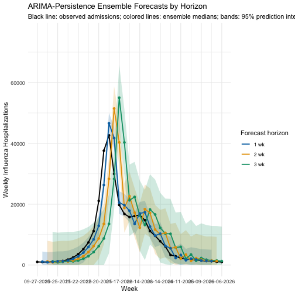

## Write Final Activity 5 Outputs

Run this chunk after reviewing the variant comparisons. It writes the selected
ensemble results to the same files used by `05_improvements.R`.


``` r
specification <- tibble(
  model = "ARIMA-persistence ensemble",
  arima_weight = 1 - selected_persistence_weight,
  persistence_weight = selected_persistence_weight,
  persistence_definition = "Observed admissions at the forecast reference date",
  leakage_check = "Only reference-date or earlier observations are used"
)

write_csv(final_long, improved_forecast_csv)
write_csv(final_scored$scores, improved_scores_csv)
write_csv(
  final_scored$summary %>%
    select(horizon, n_forecasts, mae, rmse, mean_wis, coverage_95, mean_width_95),
  improved_summary_csv
)
write_csv(final_comparison, comparison_csv)
write_csv(specification, spec_csv)

ggsave(comparison_png, comparison_plot, width = 11, height = 8, dpi = 300)

# Recreate and save the forecast plot explicitly because ggsave() saves the
# most recent plot by default. This avoids accidentally saving the comparison
# plot twice if chunks were run out of order.
forecast_plot <- ggplot() +
  geom_ribbon(data = plot_q,
              aes(x = target_end_date, ymin = `0.025`, ymax = `0.975`,
                  fill = horizon_label),
              alpha = .20, show.legend = FALSE) +
  geom_line(data = observed_plot,
            aes(x = week, y = observed),
            color = "black", linewidth = .9) +
  geom_point(data = observed_plot,
             aes(x = week, y = observed),
             color = "black", size = 1.35) +
  geom_line(data = plot_q,
            aes(x = target_end_date, y = `0.5`, color = horizon_label),
            linewidth = .85) +
  geom_point(data = plot_q,
             aes(x = target_end_date, y = `0.5`, color = horizon_label),
             size = 1.45, show.legend = FALSE) +
  scale_color_manual(values = cols, name = "Forecast horizon") +
  scale_fill_manual(values = cols) +
  scale_x_date(breaks = all_dates[seq(1, length(all_dates), by = 4)],
               date_labels = "%m-%d-%Y") +
  coord_cartesian(ylim = c(0, max_y)) +
  labs(
    x = "Week",
    y = "Weekly Influenza Hospitalizations",
    title = "ARIMA-Persistence Ensemble Forecasts by Horizon",
    subtitle = "Black line: observed admissions; colored lines: ensemble medians; bands: 95% prediction intervals"
  ) +
  theme_minimal()
ggsave(forecast_png, forecast_plot, width = 11, height = 6.5, dpi = 300)

expected_outputs <- c(
  improved_forecast_csv, improved_scores_csv, improved_summary_csv,
  comparison_csv, spec_csv, forecast_png, comparison_png,
  baseline_error_png, interval_wis_png, interval_metrics_png,
  ensemble_wis_png, ensemble_metrics_png, all_variants_wis_png,
  final_change_png, observed_trend_png, observed_distribution_png,
  baseline_distribution_png
)
if (!all(file.exists(expected_outputs))) {
  stop("One or more final Activity 5 outputs were not written.")
}

expected_outputs
```

```
##  [1] "output/data/05_improvements/ensemble_flusight_forecasts.csv"                
##  [2] "output/data/05_improvements/ensemble_forecast_scores.csv"                   
##  [3] "output/data/05_improvements/ensemble_summary_by_horizon.csv"                
##  [4] "output/data/05_improvements/activity5_model_comparison_by_horizon.csv"      
##  [5] "output/data/05_improvements/ensemble_specification.csv"                     
##  [6] "output/figures/05_improvements/ensemble_forecast_vs_observed.png"           
##  [7] "output/figures/05_improvements/activity5_metric_comparison.png"             
##  [8] "output/figures/05_improvements/baseline_absolute_error_over_time.png"       
##  [9] "output/figures/05_improvements/interval_calibration_wis_progression.png"    
## [10] "output/figures/05_improvements/interval_calibration_metrics_progression.png"
## [11] "output/figures/05_improvements/ensemble_wis_progression.png"                
## [12] "output/figures/05_improvements/ensemble_metrics_progression.png"            
## [13] "output/figures/05_improvements/all_variants_wis_progression.png"            
## [14] "output/figures/05_improvements/final_model_metric_changes.png"              
## [15] "output/figures/05_improvements/observed_admissions_overview.png"            
## [16] "output/figures/05_improvements/observed_admissions_distribution.png"        
## [17] "output/figures/05_improvements/baseline_forecast_distribution_overview.png"
```

## Complete Visual Gallery

These are the saved PNGs to open directly from the file browser or VS Code if
the inline notebook preview is not showing plots.

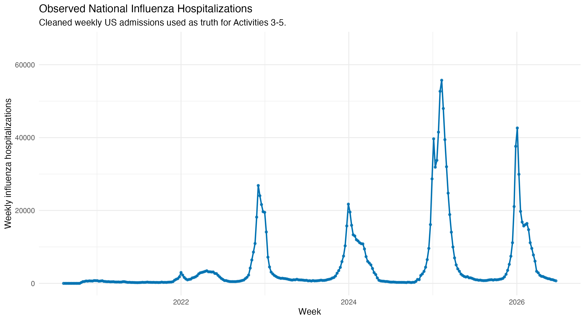

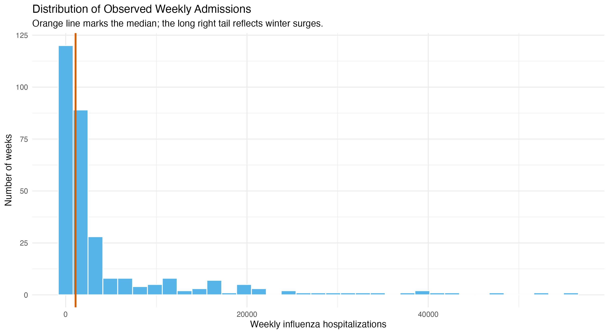

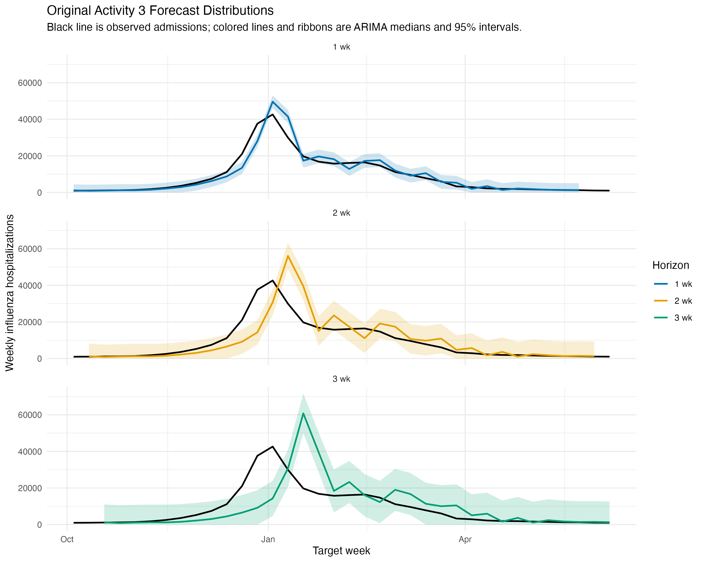

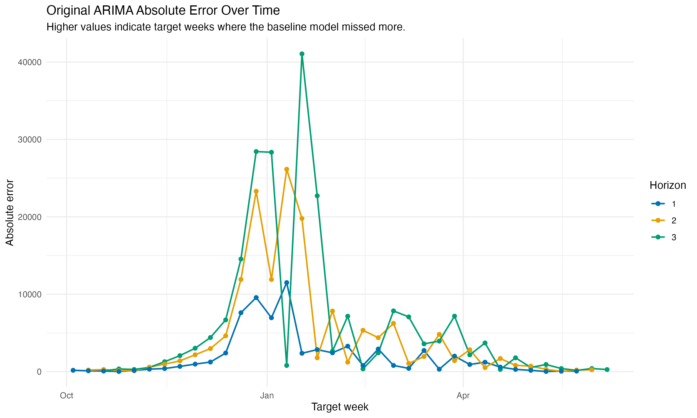

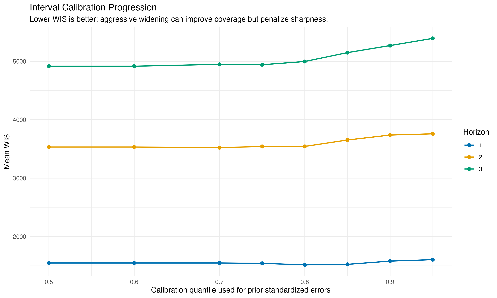

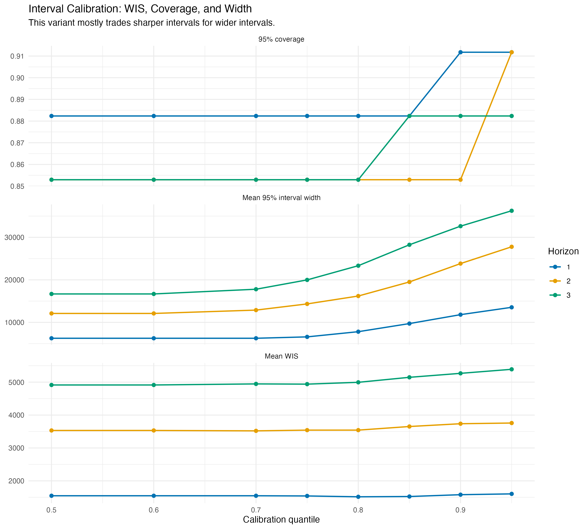

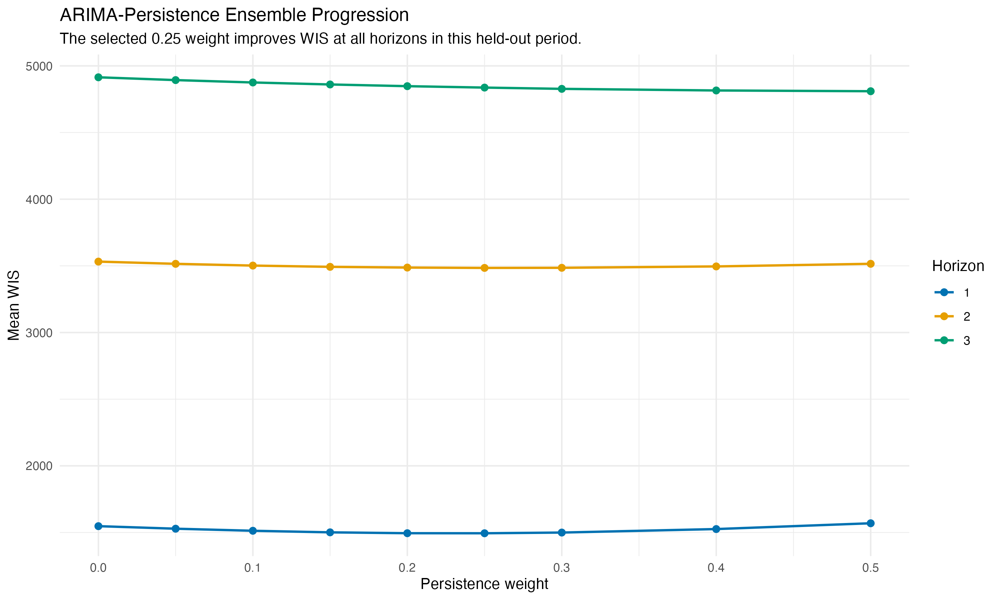

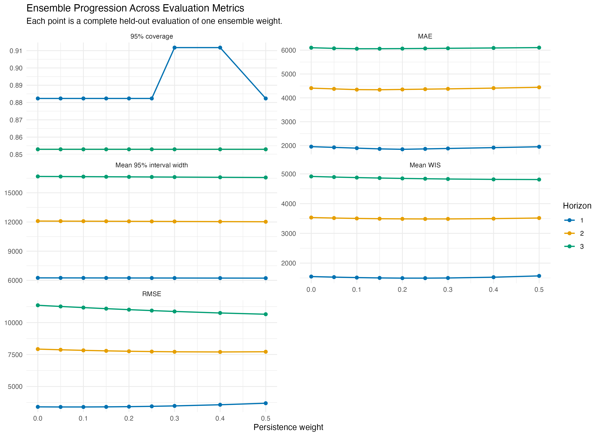

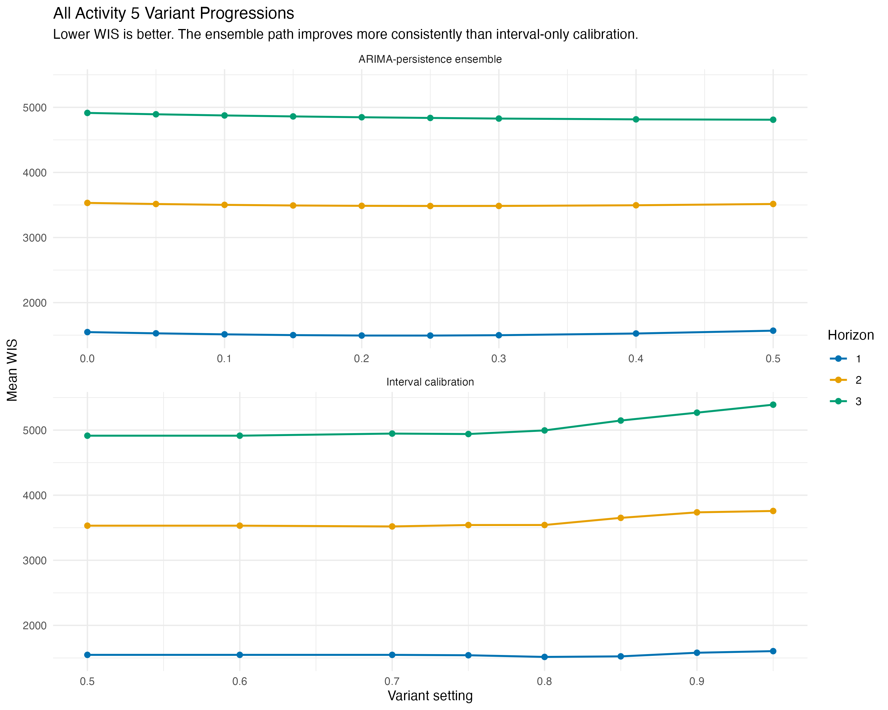

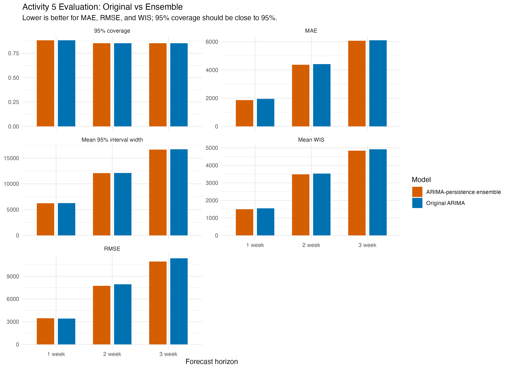

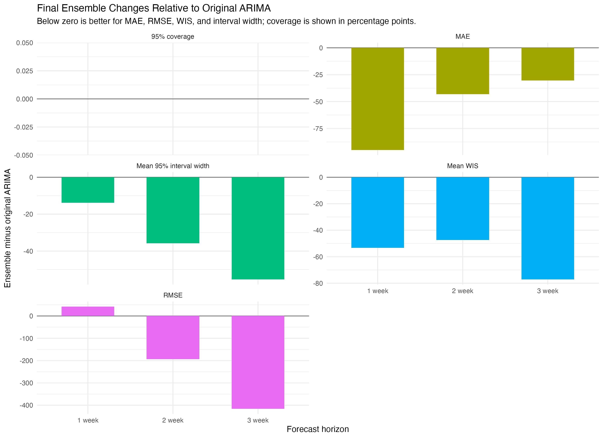

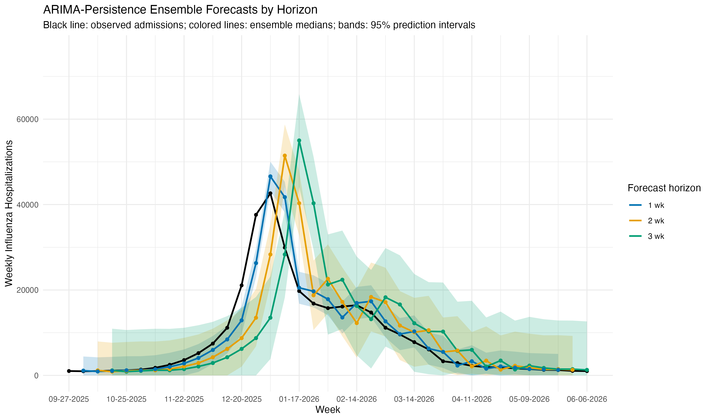
